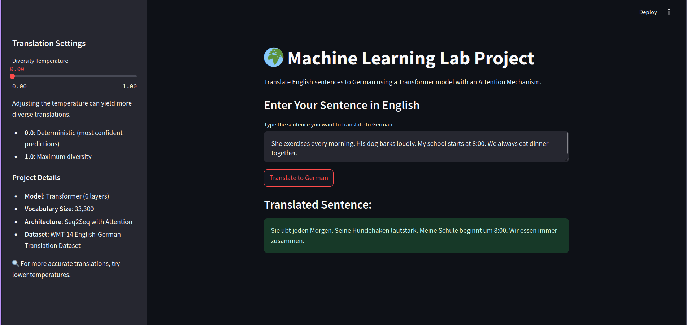
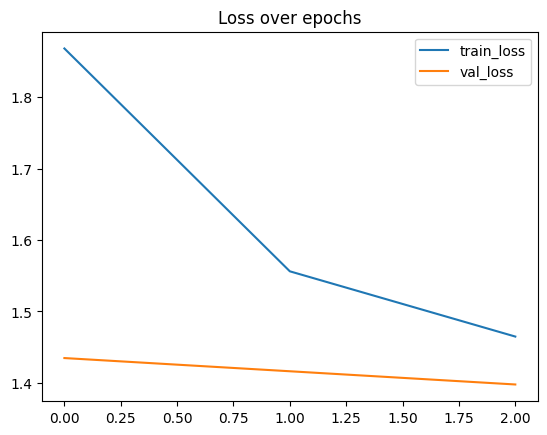
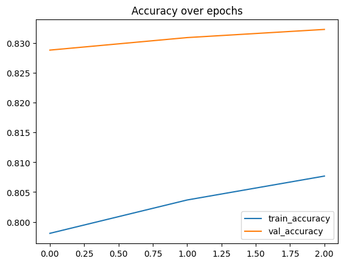

# Neural Machine Translation (NMT) for English-German

This project implements Neural Machine Translation (NMT) for translating English text to German using Seq2Seq models with Attention and Transformer architectures. The models are trained on the WMT 14 English-German dataset. The project includes a Streamlit GUI for interactive translation.

[](https://neural-machine-translation-ashish.streamlit.app/) &emsp; [](https://www.kaggle.com/code/shurtugal3023/neural-machine-translation)  

---

## Demonstration Video 🎥

<!-- Video ./outputs/demo.webm -->
[](https://github.com/user-attachments/assets/6abd2d55-cf14-4b15-a6c1-b557be926ab1)

---

## Table of Contents
1. [Introduction](#introduction)
2. [Setup and Installation](#setup-and-installation)
3. [Usage](#usage)
4. [Model Training and Data Preprocessing](#model-training-and-data-preprocessing)
5. [Results and Performance](#results-and-performance)
6. [Acknowledgments](#acknowledgments)
7. [License](#license)

---

## Introduction

### Trying normal Seq2Seq model for German to English Translation

- **Sequence-to-sequence learning (Seq2Seq)** is about training models to convert sequences from one domain (e.g., sentences in English) to sequences in another domain (e.g., the same sentences translated to German). Our aim is to translate given sentences from German to English.
- Sequence-to-Sequence (seq2seq) models are used for a variety of NLP tasks, such as text summarization, speech recognition, DNA sequence modeling, among others.
- Here, both the input and output are sentences, meaning these sentences are a sequence of words going in and out of a model. This is the basic idea of Sequence-to-Sequence modeling. The figure below explains this method.

<p align="center">
  
</p>

#### Here's how it works:

- Feed the embedding vectors for source sequences (German) to the encoder network, one word at a time.
- Encode the input sentences into fixed-dimension state vectors. At this step, we get the hidden and cell states from the encoder LSTM and feed them to the decoder LSTM.
- These states are regarded as initial states by the decoder. Additionally, it also has the embedding vectors for target words (English).
- Decode and output the translated sentence, one word at a time. In this step, the output of the decoder is sent to a softmax layer over the entire target vocabulary.

### What is LSTM?

- **Long Short-Term Memory (LSTM)** networks are a modified version of recurrent neural networks, which makes it easier to remember past data in memory. The vanishing gradient problem of RNNs is resolved here. LSTM is well-suited to classify, process, and predict time series with time lags of unknown duration. It trains the model using back-propagation. In an LSTM network, three gates are present:

<p align="center">
  
</p>

- **Input gate** — Determines which value from input should be used to modify the memory. The sigmoid function decides which values to let through (0 or 1), while the tanh function assigns weight to the values, deciding their importance, with values ranging from -1 to 1.

<p align="center">
  
</p>

- **Forget gate** — Determines what details to discard from the block. It is decided by the sigmoid function. It looks at the previous state (ht-1) and the current input (Xt), outputting a number between 0 (omit) and 1 (keep) for each number in the cell state Ct−1.

<p align="center">
  
</p>

- **Output gate** — Uses the input and memory of the block to determine the output. The sigmoid function decides which values to let through (0 or 1), while the tanh function assigns importance to values, ranging from -1 to 1, which are then multiplied with the output of the sigmoid function.

<p align="center">
  
</p>


## Setup and Installation

### Prerequisites

Ensure you have the following software installed:
- Python 3.9 or 3.10
- Virtual Environment (recommended)

### Installation

1. **Clone the repository**:
   ```bash
   git clone https://github.com/Shurtu-gal/neural-machine-translation.git
   cd neural-machine-translation
   ```

2. **LFS (Large File Storage)**:
   If you have Git LFS installed, pull the large files using:
   ```bash
   git lfs pull
   ```

   OR download from [my GitHub](https://github.com/Shurtu-gal/neural-machine-translation/raw/refs/heads/main/outputs/ende_wmt32k.pkl.gz) and place it in the `outputs` directory.

3. **Create and activate a virtual environment**:
   ```bash
   python -m venv nmt-env
   source nmt-env/bin/activate  # On Windows use `nmt-env\Scripts\activate`
   ```

4. **Install required packages**:
   ```bash
   pip install -r requirements.txt
   ```

5. **Download the Dataset**:
   Place the WMT 14 English-German dataset files into the `data` directory, or run the `preprocess.sh` script to automate the download and preprocessing steps.

## Usage

1. **Run the Streamlit App**:
   Launch the GUI to test translations:
   ```bash
   streamlit run gui/app.py
   ```
   Open the link in your browser to use the interactive translation tool.

2. **Training the Models**:
   - For a comprehensive model training on Kaggle, refer to the [Kaggle Training Notebook](https://www.kaggle.com/code/shurtugal3023/neural-machine-translation).
   - Training scripts in the `model` directory also include configurations for Seq2Seq with Attention (`seq2seq.ipynb`) and Transformer with transfer learning (`transfer.ipynb`).

3. **Evaluating Model Performance**:
   The `outputs` directory contains graphs and metrics, such as `loss_over_epochs_kaggle.png` and `accuracy_over_epochs_kaggle.png`, to visualize training progress.

## Model Training and Data Preprocessing

### Data Preprocessing
The `preprocess` directory contains:
- `preprocess.sh`: Automates data download and organization.
- `generate_vocab.py`: Creates a vocabulary for the dataset.

### Model Training
- **Seq2Seq with Attention**: Implemented in `seq2seq.ipynb`, this model is a traditional sequence-to-sequence network using LSTM units with attention to improve translation of longer sentences.
- **Transformer with Transfer Learning**: In `transfer.ipynb`, this model leverages pre-trained weights for a faster, more accurate translation task on the WMT 14 EN-DE dataset.

## Results and Performance

After training on the WMT 14 EN-DE dataset, the models achieved the following results:

These are the loss and accuracy metrics for the models:
- Loss over epochs for Seq2Seq model:


- Accuracy over epochs for Seq2Seq model:


## Acknowledgments

- **WMT 14 English-German Dataset**: Used for training and evaluation of the models.
- **Kaggle**: Provided computational resources and a collaborative environment for model development.
- **TensorFlow/Keras and Trax Libraries**: Used for model development and experimentation.